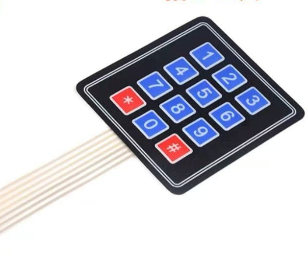

# 3X4 Keypad Demo For ESP32-WROOM-32

This demo was prebuilt with ESP-IDF tools.

Applicability warning: The code in this repository contains boot-related files for ESP32 WROOM 32. If you pull the code directly for compilation, it is only applicable to the ESP32 WROOM 32 development version. You can directly use the main.c code in other development versions, but you cannot directly use the entire source code

3X4 Keypad Photo：
  

  
-> Buy it：[TaoBao](https://e.tb.cn/h.62vVOjzYt5roBeN?tk=KVgmeuOpzhK )